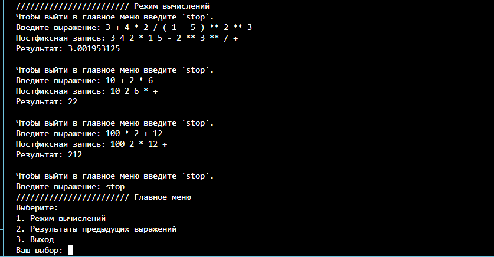
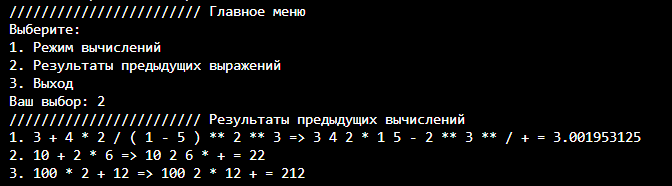

# Python Simple Console Calculator

Этот проект представляет собой простой консольный калькулятор на Python, который может преобразовывать инфиксные выражения в постфиксные и вычислять их значения. Калькулятор также сохраняет результаты предыдущих вычислений.

## Функциональность

- Преобразование инфиксных выражений в постфиксные.
- Вычисление значений постфиксных выражений.
- Сохранение и отображение результатов предыдущих вычислений.
- Интерфейс в виде консольного меню с 2 возможностями:
  1. Режим вычислений
  2. Просмотр результатов предыдущих вычислений
  3. Выход

## Установка и запуск

  1. Необходимо клонировать репозиторий:
   ```bash
   git clone https://github.com/seitablaeff/Python-Simple-Console-Calculator.git
  ```
  2. Перейти в директорию проекта:
   ```bash
   cd Python-Simple-Console-Calculator
   ```
  3. Запустить скрипт calc.py:
   ```bash
   python calc.py
   ```
## Скриншоты приложения



